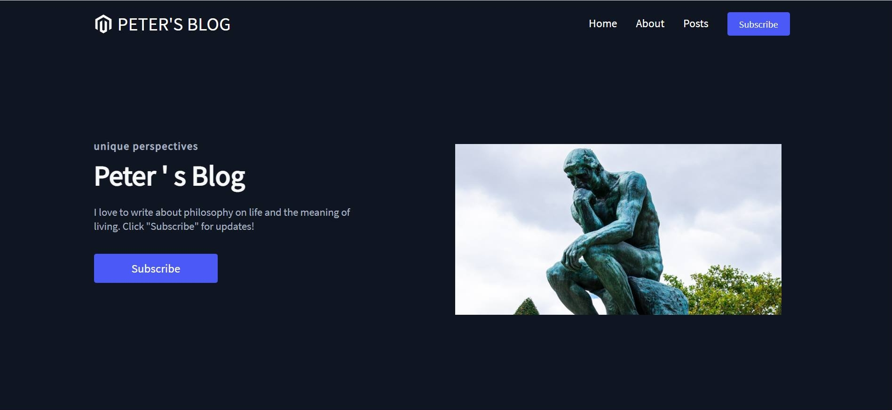

# Peter's Blog

# About 

This project is essentially a blog website for a client

The client wanted a blog website that can showcase his blog posts and have a form that allows users to subscribe to his blog.
                                            
In order to meet the needs of my client, I decided to use React.Js to build the website and then deploy it to Heroku 
                        
# Documentation

React.Js is used to create the overall website, the navigation bar, and subscription form

                        
Formspree.io is used for the backend of the form itself 

Express.js is used to help deploy the website onto Heroku 

# When user opens the website initially 

# When the user navigates to the about section in the Home Page
                 
# When the user navigates to the blog posts section in the Home Page

# When a user navigates to the subscribe section in the Home Page

# When the user is on the About Page

# When the user is on "Don't be afraid to be seen trying" section in the Posts Page

# When the user is on "Academia: Struggles of Pursuing Higher Education" section in the Posts Page

# When the user is on "Money: Monetary of currency" section in the Posts Page

# When the user navigates to the "Don't be afraid to be seen trying" Post 

# When the user navigates to the "Academia: Struggles of Pursuing Higher Education" Post 

# When the user navigates to the "Money: Monetary of currency" Post

 
# The website was deployed on Heroku: 
## https://peter-sblog.herokuapp.com/
                     
                            
                       
                   
                     
                           
                            
               
                        
                           
                           
                   
                     
